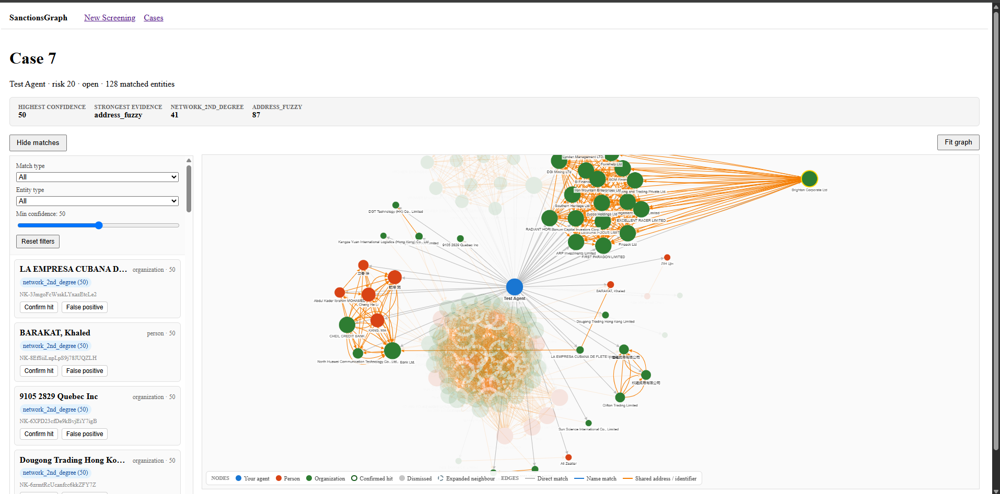

Now with 50,000 sanctioned entities in the database, it's inenvitable that I have to do some manual data creation and profiling.


I added 3 more entities into the database:

```bash
from screening.models import *

# Entity 1: A sanctioned company (the hub)
hub = SanctionedEntity.objects.create(
    name="Wong & Associates Pte Ltd",
    entity_type="organization",
    source_id="NK-demo-hub"
)
EntityAddress.objects.create(entity=hub, full_text="Suite 1201, 88 Collyer Quay, Singapore 049320", country_code="sg")
EntityAlias.objects.create(entity=hub, text="Wong Associates")

# Entity 2: A sanctioned person (shares address with hub)
person_a = SanctionedEntity.objects.create(
    name="Li Wei",
    entity_type="person",
    source_id="NK-demo-person-a"
)
EntityAddress.objects.create(entity=person_a, full_text="Suite 1201, 88 Collyer Quay, Singapore 049320", country_code="sg")
EntityAlias.objects.create(entity=person_a, text="David Li")

# Entity 3: Another sanctioned person (shares DIFFERENT address with person_a)
person_b = SanctionedEntity.objects.create(
    name="Zhang Min",
    entity_type="person",
    source_id="NK-demo-person-b"
)
EntityAddress.objects.create(entity=person_b, full_text="Tower A, Beijing Finance Center, Chaoyang", country_code="cn")
# ALSO give person_b the same address as person_a - this creates the 2nd-degree path
EntityAddress.objects.create(entity=person_b, full_text="Suite 1201, 88 Collyer Quay, Singapore 049320", country_code="sg")

# Entity 4: A PEP (politically exposed person) with a fuzzy name match
pep = SanctionedEntity.objects.create(
    name="Sergei Lavrov",
    entity_type="person",
    source_id="NK-demo-pep"
)
EntityAlias.objects.create(entity=pep, text="Sergey Lavrov")

print("Demo data created: 4 entities, 5 addresses, 3 aliases")

```


and submitted an the following agent with the details;

```bash
| Field           | Value                                                                                 |
| --------------- | ------------------------------------------------------------------------------------- |
| **Name**        | `Sergey Lavrov`                                                                       |
| **Nationality** | `ru`                                                                                  |
| **Aliases**     | `Sergei Lavrov, Lavrov Education`                                                     |
| **Addresses**   | `[{"full_text":"Suite 1201, 88 Collyer Quay, Singapore 049320","country_code":"sg"}]` |
| **Identifiers** | `[]`                                                                                  |
```


What we are seeing is the blue node in the middle with the name Sergey Lavrov. There is an edge between the blue node and 3 other nodes (created from above) where the connections are specified as:

| Match           | Why it matched                                                                                       | Confidence |
| --------------- | ---------------------------------------------------------------------------------------------------- | ---------- |
| `address_fuzzy` | Agent address matches **Wong & Associates**                                                          | 100%       |
| `address_fuzzy` | Agent address matches **Li Wei**                                                                     | 100%       |
| `address_fuzzy` | Agent address matches **Zhang Min**                                                                  | 100%       |
| `address_fuzzy` | Agent address matches a **real company** (NAYARA ENERGY) that was already in your OpenSanctions data | 100%       |
| `name_exact`    | Agent name `Sergey Lavrov` matches alias `Sergey Lavrov` on the **Sergei Lavrov** record             | 95%        |


---

## Later: the "Hong Kong" density problem and UI fix

I screened another test agent to see how the graph behaves with a very broad address:

| Field       | Value                                             |
| ----------- | ------------------------------------------------- |
| Name        | `Asia Power Consulting`                           |
| Nationality | `hk`                                              |
| Aliases     | `APC`                                             |
| Addresses   | `[{"full_text":"Hong Kong","country_code":"hk"}]` |
| Identifiers | `[]`                                              |

The result was **Case 6**, risk 100, with a huge hairball graph. Because "Hong Kong" is such a generic address string, it fuzzy-matches a large number of sanctioned entities and then draws all the `shared_address` edges between them. The left sidebar also looked broken: every match showed the same explanation text, so it looked like duplicates even though each row was a different entity.

### What I changed in `frontend/src/views/CaseDetail.vue`

1. **Grouped matches by entity.** The sidebar now shows one card per matched entity, with the entity name, type, source_id, and all the match reasons collapsed into chips. This removes the "duplicate" look and makes the strongest confidence obvious.
2. **Collapsible sidebar.** There is a toggle to hide the match list so the graph can use the full width.
3. **Better graph styling for dense networks:**
   - Node size is now proportional to degree.
   - Labels are hidden on low-degree nodes until hovered, which dramatically reduces visual noise.
   - Added color coding: agent = blue, person = red/orange, organization = green.
   - Edges are color-coded by relationship type (name, shared attribute, etc.).
   - Added a "Fit graph" button.
   - Tuned the `cose` layout parameters for tighter, more stable layouts on large graphs.
4. **Responsive layout.** The sidebar collapses below 800 px and the graph height is reduced on small screens.

### Verification

- `npm test` passed (12/12).
- `npm run build` passed (`vue-tsc` + Vite).

### Lesson

The matcher is doing what it is supposed to do, but broad addresses like "Hong Kong" or "Russia" produce noisy results. The UI should make it easy to see *which* entities matched and why, and it should give users control over how much of the graph they see at once. A future improvement could be an address-quality hint in the screening form ("this address is very broad — expect many matches").


---

## Implemented: address quality, risk scoring, and case-detail filters/summary

I turned the failing TDD tests into working features.

### Backend

1. **`backend/screening/address_quality.py`**
   - `assess_address_quality(full_text)` scores addresses from 0.0 to 1.0.
   - Broad strings like "Hong Kong", "Russia", "Moscow" score low.
   - Addresses containing digits (street numbers, postal codes) score 1.0.
   - Multi-token addresses without digits score 0.7 (catches translations like "Moscow, Russian Federation").
   - `apply_address_penalty()` scales fuzzy-address confidence by the quality score.

2. **`backend/screening/matcher.py`**
   - `_address_fuzzy_matches()` now calls `assess_address_quality()` for every agent address and applies the penalty to each hit.
   - The explanation text appends "(broad address, confidence reduced)" when this happens.

3. **`backend/screening/risk_scoring.py`**
   - `calculate_case_risk_score(matches)` replaces the old `max(confidence)` logic.
   - It scores each entity by its strongest evidence tier, adds a target bonus, adds a diversity bonus for multiple match types on the same entity, and dampens noisy low-tier hits when there are many of them.
   - Result is always an integer in [0, 100].

4. **`backend/screening/views.py`**
   - `ScreenView` now uses `calculate_case_risk_score(results)` for `case.risk_score`.

### Frontend

1. **`frontend/src/composables/useAddressQuality.ts`**
   - Mirrors the backend address-quality logic for instant form feedback.

2. **`frontend/src/composables/useMatchFilters.ts`**
   - Reactive filters by match type, entity type, and minimum confidence.
   - Returns sorted matches and a `resetFilters()` function.

3. **`frontend/src/composables/useRiskSummary.ts`**
   - Computes unique entity count, highest confidence, match-type counts, top 3 entities, and strongest evidence tier.

4. **`frontend/src/views/AgentForm.vue`**
   - Shows an orange warning box below the address textarea when any entered address is broad.

5. **`frontend/src/views/CaseDetail.vue`**
   - Added a summary bar with highest confidence, strongest evidence tier, and match-type counts.
   - Added filter controls in the match sidebar.
   - Match cards are now built from filtered matches.

### Tests

All tests pass:
- Backend: `uv run pytest` → 49 passed
- Frontend: `npm test` → 33 passed
- Frontend build: `npm run build` → clean (only the existing cytoscape chunk-size warning)

### What is still rough

- The broad-term denylist is small and hardcoded. A real system would use a country/city gazetteer.
- `SanctionedEntity` still does not store the OpenSanctions `target` flag, so the target bonus in risk scoring is not used by the live API yet. The function is tested and ready; integrating `target` requires a model + ingestion change.
- The graph still renders all 128 Hong Kong matches at once. Filters help, but a future "expand 2nd-degree on click" feature would make dense cases even easier to read.


---

## Implemented: OpenSanctions `target` flag integration

I added end-to-end support for the `target` flag so the risk scorer treats direct sanctions/PEP targets as more serious than related parties.

### Backend changes

1. **`screening/models.py`**
   - Added `SanctionedEntity.is_target` BooleanField(default=False).

2. **`screening/migrations/0005_sanctionedentity_is_target_alter_agent_id.py`**
   - Auto-generated migration; applied with `uv run manage.py migrate`.

3. **`screening/management/commands/ingest_opensanctions.py`**
   - `parse_entity()` now reads `entity.get("target", False)`.
   - `flush()` writes `is_target` into each `SanctionedEntity` bulk_create row.

4. **`screening/views.py`**
   - `ScreenView` now looks up `is_target` for every matched entity and enriches the matcher results before passing them to `calculate_case_risk_score()`.

5. **`screening/serializers.py`**
   - `MatchSerializer` exposes `is_target` from `entity.is_target`.

### Tests

New file `backend/screening/test/test_target_flag.py` covers:
- Model field defaults and explicit True/False
- Ingestion parser captures target=true/false/missing
- Screening API returns `is_target` per match and produces a higher risk score when a target is hit

### Verification

- `uv run pytest` → 55 passed
- `uv run manage.py migrate` → applied cleanly
- Frontend `npm test` and `npm run build` → still clean

The target bonus is now live in the API risk score.


---

## Fixed: Case Detail page rendered "0 matched entities" and an empty graph after screening

The user reported that after entering a specific address in the New Screening form, the broad-address warning disappeared, but the case detail page showed **0 matched entities** and an empty graph even though the API had returned matches and a risk score of 100.

### Root cause

`frontend/src/views/CaseDetail.vue` passed the *unwrapped* value `matches.value` into `useMatchFilters()` and `useRiskSummary()`. Because those composables call `toValue()`, the snapshot was taken once (an empty array) and never recomputed when `matches.value = caseData.matches` was assigned after the API resolved.

### Fix

- Pass the `matches` ref directly into both composables so they stay reactive.
- Also fixed the pluralization bug that rendered "0 matched entityies".

### Tests added

1. **Vitest component tests** (`frontend/src/views/CaseDetail.test.ts`)
   - Mocked `../services/api` with `vi.mock`.
   - Added a `caseId` prop to `CaseDetail.vue` so the component can be mounted without a real router.
   - Tests assert that match cards and summary stats render after the mocked API resolves.
   - `npm test` → 35 passed.

2. **Playwright end-to-end tests** (`frontend/e2e/case-detail.spec.ts`)
   - `frontend/playwright.config.ts` starts the Vite dev server automatically and points it at `http://localhost:5173`.
   - The spec intercepts `/api/cases/1/` and `/api/cases/1/network/` with mocked JSON, navigates to `/cases/1`, and asserts:
     - The match card for "Sergei Lavrov" is visible.
     - The summary shows "1 matched entity" and "risk 100".
     - An empty match list renders the empty state when the API returns no matches.
   - Run with `npm run test:e2e` → 3 passed.
   - `vite.config.ts` was updated to exclude `e2e/` from Vitest so the two runners stay separate.

### Verification

- `npm test` → 35 passed
- `npm run build` → clean (only the existing cytoscape chunk-size warning)
- `npm run test:e2e` → 3 passed


---

## Fixed: graph area rendered blank while the match list worked

The user reported that Case 8 showed 4 matched entities in the sidebar but the graph area was completely empty. The API was returning a valid graph (`/api/cases/8/network/` had nodes and edges), so this was a frontend rendering bug.

### Root cause

In `frontend/src/views/CaseDetail.vue`, `renderGraph(graph)` was called inside `onMounted` **before** `loading.value = false` ran (that happened in `finally`). While `loading` is true, the template renders "Loading case..." and the entire `v-else` block — including `<div class="graph-container" ref="graphEl">` — is not in the DOM. So `renderGraph` hit `if (!graphEl.value) return;` and silently did nothing. By the time the container appeared, cytoscape had never been initialized.

### Fix

1. Set `loading.value = false` and `await nextTick()` **before** `renderGraph(graph)`, so the container exists when cytoscape initializes.
2. Added a separate `graphError` ref: a cytoscape failure (e.g. jsdom has no layout box) now shows an error inside the graph area only, instead of wiping out the whole page. This also makes the existing comment in the catch block true — the match list stays usable.

### Regression test

Added a Playwright test (`frontend/e2e/case-detail.spec.ts`) that asserts a `<canvas>` element is visible inside `.graph-container` with nonzero dimensions and that no `.graph-error` is shown. The previous e2e tests only checked the sidebar, which is why this slipped through.

### Verification

- `npm test` → 35 passed
- `npm run test:e2e` → 4 passed
- `npm run build` → clean

### Lesson

Any `ref` attached to an element inside a conditional template branch is `null` until the branch renders *and* a tick passes. DOM-dependent work (cytoscape, charts, maps) must run after `await nextTick()`, and a rendering failure in one panel should never take down the whole page.


---

## Added: graph legend + filter-linked graph dimming

Two UX gaps called out by the user while exploring Case 6 (the 128-entity Hong Kong hairball):

### 1. Legend

The graph used colors for node types (blue agent, red person, green organization) and edge types (grey direct match, blue name match, orange shared address/identifier) but never explained them anywhere. Added a `.graph-legend` overlay in the bottom-left of the graph area covering all three node colors and all three edge colors.

### 2. Filters now affect the graph

Previously the sidebar filters (match type, entity type, min confidence) only changed the sidebar list — the graph kept showing everything, which was confusing (selecting "Identifier exact" showed an empty list next to a full graph). Now `CaseDetail.vue` watches `filteredMatches` and applies a `.dimmed` class (opacity 0.12) to non-matching nodes and their edges, rather than removing them — the linked-views pattern used by link-analysis tools compliance teams know (Linkurious, Maltego, Graphistry). Dimming instead of deleting keeps the surrounding network context visible.

Implementation notes:
- `updateGraphVisibility()` runs on every filter change and once after cytoscape initializes.
- Agent edges are additionally dimmed when they don't match the selected match type.
- A dev-only `window.__cy` hook lets the Playwright test inspect canvas-rendered graph state.

### Tests

- New Vitest test: legend renders with all six entries.
- New Playwright test: selecting a match type with no matches empties the sidebar **and** dims all entity nodes/edges; "Reset filters" restores full visibility.

### Verification

- `npm test` → 36 passed
- `npm run test:e2e` → 5 passed
- `npm run build` → clean


---

## Added: sidebar→graph focus + match resolution workflow

The two compliance-officer features proposed earlier, built TDD-style.

### 1. Clicking a sidebar card focuses the graph node

`frontend/src/views/CaseDetail.vue`: clicking an entity card sets `selectedEntityId`, highlights the card (blue outline), selects the corresponding cytoscape node (yellow ring via the existing `:selected` style), and animates the viewport to center on it. Keyboard accessible (`role="button"`, Enter key). The list and the graph are now true linked views.

### 2. Resolve / dismiss workflow

**Backend** — new `MatchViewSet` at `PATCH /api/matches/<id>/`:
- Officers set `resolved` + `resolution` (`confirmed` or `false_positive`).
- `MatchResolutionSerializer` keeps matcher-owned fields (confidence, match_type) read-only and validates the resolution value.
- Case status rolls up: when every match on a case is resolved the case becomes `resolved`; reopening any match reopens it.
- `backend/screening/test/test_match_resolution.py` — 9 tests covering confirm, dismiss, reopen, validation, 404, field immutability, and the status rollup.

**Frontend** — entity cards now have `Confirm hit` / `False positive` buttons (or a badge + `Reopen` once reviewed). The action applies to all matches of that entity, the card dims and shows the badge, and `frontend/src/services/api.ts` got `updateMatchResolution()`. Errors surface inline in the sidebar (`actionError`) instead of wiping the page.

### Tests

- Backend: `uv run pytest` → 64 passed (9 new)
- Frontend unit: `npm test` → 39 passed (3 new: card selection, dismiss, reopen)
- E2E: `npm run test:e2e` → 7 passed (2 new: card click selects + centers the node via `window.__cy`; dismissing a match shows the badge)
- `npm run build` → clean


---

## Follow-up: review decisions now show on graph nodes

The user dismissed NAYARA ENERGY as a false positive and noticed two things: the card only dimmed slightly, and the graph node stayed bright green — the graph didn't reflect the review decision at all.

### Changes (`frontend/src/views/CaseDetail.vue`)

1. **`updateGraphVisibility()` now applies review state classes.** An entity counts as reviewed only when *all* its matches are resolved. The resolution then maps to a node class:
   - `dismissed` (false positive) → node turns grey (`#9e9e9e`), label fades, and all its edges dim.
   - `confirmed` → node gets a thick dark-green ring.
2. **Stronger card dim.** Resolved cards went from `opacity: 0.65` to `0.5` with a grey background — the reviewed state is now obvious at a glance.
3. **Legend extended** with "Confirmed hit" (green-ringed dot) and "Dismissed" (grey dot) so the new node states are explained.

### Tests

- Unit legend test updated for the two new entries.
- The e2e dismiss test now also asserts the graph node gets the `dismissed` class (and not `confirmed`).

### Verification

- `npm test` → 39 passed
- `npm run test:e2e` → 7 passed
- `npm run build` → clean

### Lesson

Every state change that exists in the list must be visible in the graph. Compliance officers think in terms of decisions, not UI panels — if a decision doesn't change the picture, it doesn't feel real.

---

## Implemented: on-demand neighbour expansion (TODO #1)

Profiling first, before any code: on Case 6 the matcher already *computes* 172 entities at distance 3 and silently discards them (`cutoff=2` in `matcher.py`). Name-match seeding and shared-alias edges turned out to add **zero** links on real data — the hidden mass was the discarded third hop, not missing seeding rules.

Chose **Option B (on-demand expansion)** over a 3rd-degree match tier: exploration without polluting the match list or the audit snapshot.

### Backend (tests first — `screening/test/test_entity_neighbours.py`, 9 tests)

1. **`GET /api/entities/<id>/neighbours/`** (`EntityViewSet.neighbours`): returns entities sharing an address or identifier with the given entity, in cytoscape shape. Edges carry a `detail` field with the actual shared evidence (the address string, or "shared identifier" since hashes are meaningless to analysts). Nothing is persisted.
2. **Topology fix in `build_network`**: `network_2nd_degree` matches no longer get a fake direct agent→entity edge. The true path (agent → bridge → entity) is carried by the shared-attribute edges. Note: this only affects *new* screenings — existing snapshots are frozen by design, so re-screen Case 6 to see it.

### Frontend

- `getNeighbours()` in `services/api.ts`.
- Tapping any entity node expands it: neighbours are fetched once per node and placed in a ring around it (no full re-layout, so the graph doesn't reshuffle). Expanded nodes get a dashed grey border and the `context` class, are exempt from filter dimming (they're analyst-invoked, not matches), and appear in the legend as "Expanded neighbour".
- New e2e test: tap → neighbour node + edge appear with the `context` class → filter changes don't dim it.

### Verification

- Backend: `uv run pytest` → 73 passed (9 new)
- Frontend: `npm test` → 39 passed, `npm run test:e2e` → 8 passed, `npm run build` → clean

---

## Implemented: 100% pytest coverage of screening logic (TODO #2, minus deployment)

Added `pytest-cov` as a dev dependency and a `[tool.coverage.run]` config in `backend/pyproject.toml` that omits test files and migrations (scaffolding, not logic). Target command: `uv run pytest --cov=screening --cov-report=term-missing`.

Starting point was 90% (the ingestion command was at 29%). +35 new tests (73 → 108) closed every gap:

- **`test_ingest_opensanctions.py`** (new, 17 tests): `parse_country_code`, `CommandError` on a missing dump, full run creates entities/aliases/addresses/identifiers with parsed values, malformed lines, schema/no-name/no-id skips, `--limit`, `--batch-size 1`, intra-batch dedup, idempotent re-run, stdout reporting.
- **`test_matcher.py`** (+6): blank-name guards, empty-address guard, empty-frontier early return, plain-string agent addresses, `_collect` tier-replacement branch.
- **`test_serializers.py`** (new, 7): resolution validation, agent-id validation, dict-form and pair-form identifier normalisation, malformed/empty identifier rejection.
- **`test_models.py`** (+2): both `__str__` methods.
- **`test_match_resolution.py`** (+1): `GET /api/matches/<id>/`.
- **`test_api.py`** (+1): live network rebuild when the snapshot is empty.
- **`test_address_quality.py`** (+1): the short-numberless-address fallback ("Novosibirsk" → broad, 0.3).

Two production-code warts surfaced (kept as defensive code, noted for later): `counts["entities"]` counts attempted rather than inserted rows if `bulk_create` silently drops one; and the empty-address guard in `_address_fuzzy_matches` is unreachable through `screen()` because `_agent_addresses` already strips empties.

Final: **100% line coverage on every screening module, 108 tests passing.** Deployment half of TODO #2 remains open.

#### Todo

1. ~~surface 100+ hidden 2nd-degree links via addresses and aliases~~ — done via on-demand expansion (the hidden links were the discarded 3rd hop, not aliases)
2. ~~verify screening logic with 100% pytest coverage~~ — done; deploy stack to Vercel and Railway still open.


To get to 100% coverge for the backend codebase, I added 17 more tests in `test_ingest_opensanctions.py` and 7 more in `test_serializers.py` and voilà:


<details> 

<summary>Running the coverage report</summary>


```bash
uv run pytest --cov=screening --cov-report=term-missing
========================================== test session starts ==========================================
platform linux -- Python 3.12.13, pytest-9.1.1, pluggy-1.6.0
django: version: 6.1.1, settings: sanctionsgraph.settings (from ini)
rootdir: /home/sething2002/personal-projects/VueDjango/sanctions-graph/backend
configfile: pytest.ini
plugins: cov-7.1.0, django-4.14.0
collected 108 items                                                                                     

screening/test/test_address_quality.py ..                                                         [  1%]
screening/test/test_api.py ......                                                                 [  7%]
screening/test/test_entity_neighbours.py .........                                                [ 15%]
screening/test/test_ingest_opensanctions.py ..............                                        [ 28%]
screening/test/test_match_resolution.py ..........                                                [ 37%]
screening/test/test_matcher.py .................                                                  [ 53%]
screening/test/test_models.py .....                                                               [ 58%]
screening/test/test_serializers.py ........                                                       [ 65%]
screening/test/test_target_flag.py ...                                                            [ 68%]
screening/test/test_address_quality.py ...........                                                [ 78%]
screening/test/test_ingest_opensanctions.py ...                                                   [ 81%]
screening/test/test_matcher.py .                                                                  [ 82%]
screening/test/test_models.py ......                                                              [ 87%]
screening/test/test_risk_scoring.py ..........                                                    [ 97%]
screening/test/test_target_flag.py ...                                                            [100%]

============================================ tests coverage =============================================
___________________________ coverage: platform linux, python 3.12.13-final-0 ____________________________

Name                                                    Stmts   Miss  Cover   Missing
-------------------------------------------------------------------------------------
screening/__init__.py                                       0      0   100%
screening/address_quality.py                               25      0   100%
screening/admin.py                                          6      0   100%
screening/apps.py                                           3      0   100%
screening/management/__init__.py                            0      0   100%
screening/management/commands/__init__.py                   0      0   100%
screening/management/commands/ingest_opensanctions.py     126      0   100%
screening/matcher.py                                      136      0   100%
screening/models.py                                        66      0   100%
screening/risk_scoring.py                                  42      0   100%
screening/serializers.py                                   65      0   100%
screening/views.py                                        118      0   100%
-------------------------------------------------------------------------------------
TOTAL                                                     587      0   100%
========================================== 108 passed in 3.98s ==========================================
```                                                                                      
</details>


I took a stab at playing around some more with this new beahvior. I found that moving the confidence bar over 50 removed a lot of entities, which could help users make out the figure more clearly.

</img>


---

## Fix: removed cytoscape `degree` data warning + what node taps do

The user hit a console warning: `Do not assign mappings to elements without corresponding data (i.e. ele 'entity-...' has no mapping for property 'width' with data field 'degree')`. It came from using `width: "mapData(degree, ..."` and a `[degree < 2]` selector in the stylesheet — both read `degree` from node data, but `degree` is a cytoscape-computed property, not a data field.

### Fix (`frontend/src/views/CaseDetail.vue`)

- Replaced `mapData(degree, ...)` node width/height with function-based styles that call `ele.degree()` live.
- Replaced the `[degree < 2]` label-hiding selector with a function-based `label` style that returns `""` for low-degree nodes.
- Updated `mouseout` to clear the hover label bypass via `removeStyle("label")`, restoring the function-based rule.
- Removed the data-stamping workaround that was added for the old mapData approach.

This means node size and label visibility are computed from the live topology, so newly expanded neighbours get correct sizes/labels automatically without any data patching.

### Behaviour when you tap/click each node type

- **Your agent (blue node)**: nothing happens. It is the fixed center of the graph.
- **Any matched entity (red/green node, solid border)**: the first tap selects it (yellow ring), centers the view on it, and fetches its neighbours from `/api/entities/<id>/neighbours/`. New nodes appear in a ring around it with **dashed grey borders** — those are the expanded context layer. A second tap on the same node does nothing (you already expanded it).
- **An expanded neighbour (dashed border)**: same as above — you can keep walking the network one hop at a time.
- **A dismissed node (grey)**: still tappable — being dismissed only changes its color/opacity, not its expansion behaviour.
- **A confirmed node (green ring)**: still tappable.

### Tests

- Added a console-warning regression to the e2e graph-render test: asserts no `no mapping for property` warnings are emitted.
- `npm test` → 39 passed
- `npm run test:e2e` → 8 passed
- `npm run build` → clean

---

## Fix: double-tapping a node no longer expands it twice

The user reported that tapping a node twice caused it to expand again, blowing up the graph. The original guard used a component-local `Set` (`expandedEntityIds`), which is fragile in dev/HMR and doesn't survive a re-mount.

### Fix (`frontend/src/views/CaseDetail.vue`)

- Removed `expandedEntityIds`.
- The expanded state is now stored on the node itself via an `expanded` class.
- `expandEntity()` guards with `if (node.hasClass("expanded")) return;`, adds the class immediately, and removes it only if the fetch fails.
- E2E expansion test now asserts a second tap on the same node leaves node and edge counts unchanged.

### Verification

- `npm test` → 39 passed
- `npm run test:e2e` → 8 passed
- `npm run build` → clean

Alright, time to deploy ...

---

## Removal: tap-to-expand neighbour feature

The user decided the tap-to-expand behaviour was confusing and asked for it to be removed entirely.

### Backend changes

- Restored `backend/screening/views.py` to a clean state after an accidental corruption left a duplicated `build_network` body and a stray `AgentViewSet`.
- Removed `EntityViewSet` and its `neighbours` action.
- Removed the `entities` router registration from `backend/sanctionsgraph/urls.py`.
- Deleted `backend/screening/test/test_entity_neighbours.py`.
- Added `test_network_links_entities_with_shared_address_or_identifier` to `backend/screening/test/test_api.py` to keep `build_network`'s shared-edge path at 100% coverage.

### Frontend changes

- Removed `getNeighbours` from `frontend/src/services/api.ts`.
- Removed `expandEntity`, the `cy.on("tap", "node", ...)` handler, the `node.context` style, and the "Expanded neighbour" legend item/CSS from `frontend/src/views/CaseDetail.vue`.
- Removed the tap-to-expand e2e test from `frontend/e2e/case-detail.spec.ts`.
- Removed the "Expanded neighbour" legend assertion from `frontend/src/views/CaseDetail.test.ts`.

### Verification

- `uv run pytest --cov=screening --cov-report=term-missing -q` → 100 passed, 100% coverage
- `npm test` → 39 passed
- `npm run test:e2e` → 7 passed
- `npm run build` → clean

Tapping a node now does nothing; only sidebar card clicks focus/select a node.


---

## Fix: cap node sizes to stop hubs from becoming giant balls

Dense cases (e.g., Case 7) rendered a few highly-connected organizations as enormous green circles that swallowed their neighbours. The old size formula grew linearly with degree:

```javascript
16 + Math.max(0, degree - 1) * (32 / 19)
```

A node with 50+ shared-address links could end up ~100 px wide.

### Changes (`frontend/src/views/CaseDetail.vue`)

- Added `nodeSize(degree)` using a capped log curve:
  - base 22 px,
  - + `log2(degree) * 8`,
  - capped at 44 px.
- Replaced the linear `width`/`height` style functions with `nodeSize(ele.degree())`.
- Tuned the `cose` layout to reduce overlap:
  - `componentSpacing` 80 → 120,
  - `idealEdgeLength` 60 → 100,
  - `nodeRepulsion` 800000 → 1200000.

### Reasoning

Log scaling means hubs are still slightly larger than leaf nodes, but the size difference is bounded, so clusters remain readable. The layout tuning pushes overlapping components apart without changing the overall force-directed feel.

### Verification

- `npm test` → 39 passed
- `npm run test:e2e` → 7 passed
- `npm run build` → clean


---

## Fix: clarify the graph legend

The old legend called grey agent→entity edges "Direct match" while blue agent→entity edges were "Name match" — both are direct matches, so the label was misleading. The user found it confusing.

### Changes

- Added an explicit `category` field to every edge in `backend/screening/views.py`:
  - `name` for `name_exact` / `name_fuzzy`
  - `identifier_address` for `identifier_exact` / `address_fuzzy`
  - `shared` for `shared_address` / `shared_identifier`
- Updated frontend edge styles in `frontend/src/views/CaseDetail.vue` to select by `category` instead of fragile label substrings.
- Rewrote the legend into two clear groups:
  - **Agent matches**: Name match (blue), Identifier / address match (grey)
  - **Entity links**: Shared address / identifier (orange)
- Updated `frontend/src/views/CaseDetail.test.ts` and `backend/screening/test/test_api.py` to assert the new categories and legend text.

### Verification

- `uv run pytest --cov=screening --cov-report=term-missing -q` → 101 passed, 100% coverage
- `npm test` → 39 passed
- `npm run test:e2e` → 7 passed
- `npm run build` → clean


---

## Fix: restore orange shared edges on older snapshots

After deploying the category-based edge styles, existing cases (screened before the `category` field existed) lost their orange shared edges because their frozen `network_snapshot` did not include `category`. The new selectors required `category = 'shared'`, so old edges defaulted to grey.

### Change (`frontend/src/views/CaseDetail.vue`)

Added a label-based fallback to the edge style selectors:

```javascript
selector: "edge[category = 'shared'], edge[label *= 'shared']",
selector: "edge[category = 'name'], edge[label *= 'name']",
```

This keeps new snapshots using the explicit category while older snapshots still color correctly by their label. The snapshot itself stays frozen; only the renderer becomes backward-compatible.

### Verification

- `npm test` → 39 passed
- `npm run test:e2e` → 7 passed
- `npm run build` → clean


---

## Feature: click a graph node to focus its neighbourhood

Added a "focus mode" so officers can isolate a suspicious entity and see only its direct connections.

### Behaviour

- Click any entity node → it is selected and every node/edge outside its immediate neighbourhood is dimmed.
- Ctrl/Cmd + click another node → add or remove it from the focus set, so combined neighbourhoods are visible.
- Click the canvas background → clear focus.
- A "Clear focus" button appears in the graph toolbar while focus mode is active.
- Clicking a sidebar card also focuses that entity in the graph.

### Implementation (`frontend/src/views/CaseDetail.vue`)

- Added `focusedNodeIds` ref and `focusNode` / `clearFocus` helpers.
- Extended `updateGraphVisibility()` to compute `closedNeighborhood()` of focused nodes and dim anything outside it.
- Added `tap` handlers on nodes and the canvas background.
- Added a conditional "Clear focus" button next to "Fit graph".

### Tests

- Updated `frontend/e2e/case-detail.spec.ts` mock data to include three matched entities and a shared edge between two of them.
- Added e2e test asserting focus on one entity dims an unconnected entity and keeps the agent + connected entity visible.
- Updated card-related locators to use `.first()` now that multiple cards exist.

### Verification

- `uv run pytest --cov=screening --cov-report=term-missing -q` → 101 passed, 100% coverage
- `npm test` → 39 passed
- `npm run test:e2e` → 8 passed
- `npm run build` → clean
