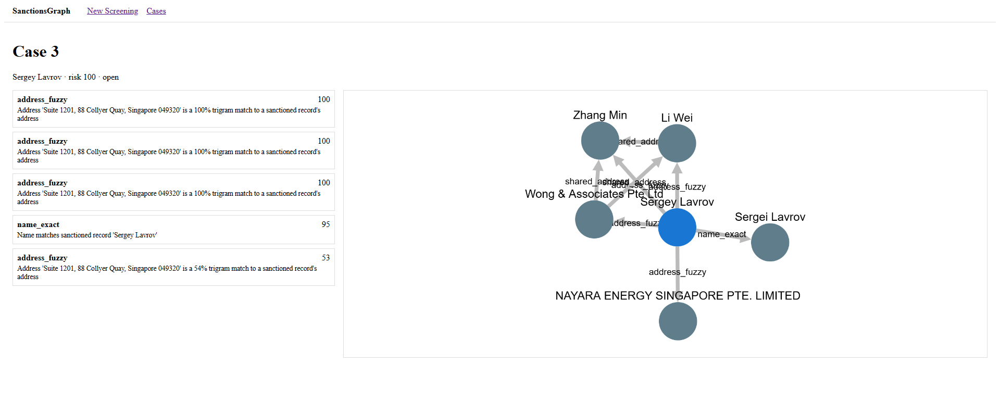

Now with 50,000 sanctioned entities in the database, it's inenvitable that I have to do some manual data creation and profiling.


I added 3 more entities into the database:

```bash
from screening.models import *

# Entity 1: A sanctioned company (the hub)
hub = SanctionedEntity.objects.create(
    name="Wong & Associates Pte Ltd",
    entity_type="organization",
    source_id="NK-demo-hub"
)
EntityAddress.objects.create(entity=hub, full_text="Suite 1201, 88 Collyer Quay, Singapore 049320", country_code="sg")
EntityAlias.objects.create(entity=hub, text="Wong Associates")

# Entity 2: A sanctioned person (shares address with hub)
person_a = SanctionedEntity.objects.create(
    name="Li Wei",
    entity_type="person",
    source_id="NK-demo-person-a"
)
EntityAddress.objects.create(entity=person_a, full_text="Suite 1201, 88 Collyer Quay, Singapore 049320", country_code="sg")
EntityAlias.objects.create(entity=person_a, text="David Li")

# Entity 3: Another sanctioned person (shares DIFFERENT address with person_a)
person_b = SanctionedEntity.objects.create(
    name="Zhang Min",
    entity_type="person",
    source_id="NK-demo-person-b"
)
EntityAddress.objects.create(entity=person_b, full_text="Tower A, Beijing Finance Center, Chaoyang", country_code="cn")
# ALSO give person_b the same address as person_a - this creates the 2nd-degree path
EntityAddress.objects.create(entity=person_b, full_text="Suite 1201, 88 Collyer Quay, Singapore 049320", country_code="sg")

# Entity 4: A PEP (politically exposed person) with a fuzzy name match
pep = SanctionedEntity.objects.create(
    name="Sergei Lavrov",
    entity_type="person",
    source_id="NK-demo-pep"
)
EntityAlias.objects.create(entity=pep, text="Sergey Lavrov")

print("Demo data created: 4 entities, 5 addresses, 3 aliases")

```


and submitted an the following agent with the details;

```bash
| Field           | Value                                                                                 |
| --------------- | ------------------------------------------------------------------------------------- |
| **Name**        | `Sergey Lavrov`                                                                       |
| **Nationality** | `ru`                                                                                  |
| **Aliases**     | `Sergei Lavrov, Lavrov Education`                                                     |
| **Addresses**   | `[{"full_text":"Suite 1201, 88 Collyer Quay, Singapore 049320","country_code":"sg"}]` |
| **Identifiers** | `[]`                                                                                  |
```





What we are seeing is the blue node in the middle with the name Sergey Lavrov. There is an edge between the blue node and 3 other nodes (created from above) where the connections are specified as:

| Match           | Why it matched                                                                                       | Confidence |
| --------------- | ---------------------------------------------------------------------------------------------------- | ---------- |
| `address_fuzzy` | Agent address matches **Wong & Associates**                                                          | 100%       |
| `address_fuzzy` | Agent address matches **Li Wei**                                                                     | 100%       |
| `address_fuzzy` | Agent address matches **Zhang Min**                                                                  | 100%       |
| `address_fuzzy` | Agent address matches a **real company** (NAYARA ENERGY) that was already in your OpenSanctions data | 100%       |
| `name_exact`    | Agent name `Sergey Lavrov` matches alias `Sergey Lavrov` on the **Sergei Lavrov** record             | 95%        |


---

## Later: the "Hong Kong" density problem and UI fix

I screened another test agent to see how the graph behaves with a very broad address:

| Field       | Value                                             |
| ----------- | ------------------------------------------------- |
| Name        | `Asia Power Consulting`                           |
| Nationality | `hk`                                              |
| Aliases     | `APC`                                             |
| Addresses   | `[{"full_text":"Hong Kong","country_code":"hk"}]` |
| Identifiers | `[]`                                              |

The result was **Case 6**, risk 100, with a huge hairball graph. Because "Hong Kong" is such a generic address string, it fuzzy-matches a large number of sanctioned entities and then draws all the `shared_address` edges between them. The left sidebar also looked broken: every match showed the same explanation text, so it looked like duplicates even though each row was a different entity.

### What I changed in `frontend/src/views/CaseDetail.vue`

1. **Grouped matches by entity.** The sidebar now shows one card per matched entity, with the entity name, type, source_id, and all the match reasons collapsed into chips. This removes the "duplicate" look and makes the strongest confidence obvious.
2. **Collapsible sidebar.** There is a toggle to hide the match list so the graph can use the full width.
3. **Better graph styling for dense networks:**
   - Node size is now proportional to degree.
   - Labels are hidden on low-degree nodes until hovered, which dramatically reduces visual noise.
   - Added color coding: agent = blue, person = red/orange, organization = green.
   - Edges are color-coded by relationship type (name, shared attribute, etc.).
   - Added a "Fit graph" button.
   - Tuned the `cose` layout parameters for tighter, more stable layouts on large graphs.
4. **Responsive layout.** The sidebar collapses below 800 px and the graph height is reduced on small screens.

### Verification

- `npm test` passed (12/12).
- `npm run build` passed (`vue-tsc` + Vite).

### Lesson

The matcher is doing what it is supposed to do, but broad addresses like "Hong Kong" or "Russia" produce noisy results. The UI should make it easy to see *which* entities matched and why, and it should give users control over how much of the graph they see at once. A future improvement could be an address-quality hint in the screening form ("this address is very broad — expect many matches").


---

## Implemented: address quality, risk scoring, and case-detail filters/summary

I turned the failing TDD tests into working features.

### Backend

1. **`backend/screening/address_quality.py`**
   - `assess_address_quality(full_text)` scores addresses from 0.0 to 1.0.
   - Broad strings like "Hong Kong", "Russia", "Moscow" score low.
   - Addresses containing digits (street numbers, postal codes) score 1.0.
   - Multi-token addresses without digits score 0.7 (catches translations like "Moscow, Russian Federation").
   - `apply_address_penalty()` scales fuzzy-address confidence by the quality score.

2. **`backend/screening/matcher.py`**
   - `_address_fuzzy_matches()` now calls `assess_address_quality()` for every agent address and applies the penalty to each hit.
   - The explanation text appends "(broad address, confidence reduced)" when this happens.

3. **`backend/screening/risk_scoring.py`**
   - `calculate_case_risk_score(matches)` replaces the old `max(confidence)` logic.
   - It scores each entity by its strongest evidence tier, adds a target bonus, adds a diversity bonus for multiple match types on the same entity, and dampens noisy low-tier hits when there are many of them.
   - Result is always an integer in [0, 100].

4. **`backend/screening/views.py`**
   - `ScreenView` now uses `calculate_case_risk_score(results)` for `case.risk_score`.

### Frontend

1. **`frontend/src/composables/useAddressQuality.ts`**
   - Mirrors the backend address-quality logic for instant form feedback.

2. **`frontend/src/composables/useMatchFilters.ts`**
   - Reactive filters by match type, entity type, and minimum confidence.
   - Returns sorted matches and a `resetFilters()` function.

3. **`frontend/src/composables/useRiskSummary.ts`**
   - Computes unique entity count, highest confidence, match-type counts, top 3 entities, and strongest evidence tier.

4. **`frontend/src/views/AgentForm.vue`**
   - Shows an orange warning box below the address textarea when any entered address is broad.

5. **`frontend/src/views/CaseDetail.vue`**
   - Added a summary bar with highest confidence, strongest evidence tier, and match-type counts.
   - Added filter controls in the match sidebar.
   - Match cards are now built from filtered matches.

### Tests

All tests pass:
- Backend: `uv run pytest` → 49 passed
- Frontend: `npm test` → 33 passed
- Frontend build: `npm run build` → clean (only the existing cytoscape chunk-size warning)

### What is still rough

- The broad-term denylist is small and hardcoded. A real system would use a country/city gazetteer.
- `SanctionedEntity` still does not store the OpenSanctions `target` flag, so the target bonus in risk scoring is not used by the live API yet. The function is tested and ready; integrating `target` requires a model + ingestion change.
- The graph still renders all 128 Hong Kong matches at once. Filters help, but a future "expand 2nd-degree on click" feature would make dense cases even easier to read.


---

## Implemented: OpenSanctions `target` flag integration

I added end-to-end support for the `target` flag so the risk scorer treats direct sanctions/PEP targets as more serious than related parties.

### Backend changes

1. **`screening/models.py`**
   - Added `SanctionedEntity.is_target` BooleanField(default=False).

2. **`screening/migrations/0005_sanctionedentity_is_target_alter_agent_id.py`**
   - Auto-generated migration; applied with `uv run manage.py migrate`.

3. **`screening/management/commands/ingest_opensanctions.py`**
   - `parse_entity()` now reads `entity.get("target", False)`.
   - `flush()` writes `is_target` into each `SanctionedEntity` bulk_create row.

4. **`screening/views.py`**
   - `ScreenView` now looks up `is_target` for every matched entity and enriches the matcher results before passing them to `calculate_case_risk_score()`.

5. **`screening/serializers.py`**
   - `MatchSerializer` exposes `is_target` from `entity.is_target`.

### Tests

New file `backend/screening/test/test_target_flag.py` covers:
- Model field defaults and explicit True/False
- Ingestion parser captures target=true/false/missing
- Screening API returns `is_target` per match and produces a higher risk score when a target is hit

### Verification

- `uv run pytest` → 55 passed
- `uv run manage.py migrate` → applied cleanly
- Frontend `npm test` and `npm run build` → still clean

The target bonus is now live in the API risk score.


---

## Fixed: Case Detail page rendered "0 matched entities" and an empty graph after screening

The user reported that after entering a specific address in the New Screening form, the broad-address warning disappeared, but the case detail page showed **0 matched entities** and an empty graph even though the API had returned matches and a risk score of 100.

### Root cause

`frontend/src/views/CaseDetail.vue` passed the *unwrapped* value `matches.value` into `useMatchFilters()` and `useRiskSummary()`. Because those composables call `toValue()`, the snapshot was taken once (an empty array) and never recomputed when `matches.value = caseData.matches` was assigned after the API resolved.

### Fix

- Pass the `matches` ref directly into both composables so they stay reactive.
- Also fixed the pluralization bug that rendered "0 matched entityies".

### Tests added

1. **Vitest component tests** (`frontend/src/views/CaseDetail.test.ts`)
   - Mocked `../services/api` with `vi.mock`.
   - Added a `caseId` prop to `CaseDetail.vue` so the component can be mounted without a real router.
   - Tests assert that match cards and summary stats render after the mocked API resolves.
   - `npm test` → 35 passed.

2. **Playwright end-to-end tests** (`frontend/e2e/case-detail.spec.ts`)
   - `frontend/playwright.config.ts` starts the Vite dev server automatically and points it at `http://localhost:5173`.
   - The spec intercepts `/api/cases/1/` and `/api/cases/1/network/` with mocked JSON, navigates to `/cases/1`, and asserts:
     - The match card for "Sergei Lavrov" is visible.
     - The summary shows "1 matched entity" and "risk 100".
     - An empty match list renders the empty state when the API returns no matches.
   - Run with `npm run test:e2e` → 3 passed.
   - `vite.config.ts` was updated to exclude `e2e/` from Vitest so the two runners stay separate.

### Verification

- `npm test` → 35 passed
- `npm run build` → clean (only the existing cytoscape chunk-size warning)
- `npm run test:e2e` → 3 passed


---

## Fixed: graph area rendered blank while the match list worked

The user reported that Case 8 showed 4 matched entities in the sidebar but the graph area was completely empty. The API was returning a valid graph (`/api/cases/8/network/` had nodes and edges), so this was a frontend rendering bug.

### Root cause

In `frontend/src/views/CaseDetail.vue`, `renderGraph(graph)` was called inside `onMounted` **before** `loading.value = false` ran (that happened in `finally`). While `loading` is true, the template renders "Loading case..." and the entire `v-else` block — including `<div class="graph-container" ref="graphEl">` — is not in the DOM. So `renderGraph` hit `if (!graphEl.value) return;` and silently did nothing. By the time the container appeared, cytoscape had never been initialized.

### Fix

1. Set `loading.value = false` and `await nextTick()` **before** `renderGraph(graph)`, so the container exists when cytoscape initializes.
2. Added a separate `graphError` ref: a cytoscape failure (e.g. jsdom has no layout box) now shows an error inside the graph area only, instead of wiping out the whole page. This also makes the existing comment in the catch block true — the match list stays usable.

### Regression test

Added a Playwright test (`frontend/e2e/case-detail.spec.ts`) that asserts a `<canvas>` element is visible inside `.graph-container` with nonzero dimensions and that no `.graph-error` is shown. The previous e2e tests only checked the sidebar, which is why this slipped through.

### Verification

- `npm test` → 35 passed
- `npm run test:e2e` → 4 passed
- `npm run build` → clean

### Lesson

Any `ref` attached to an element inside a conditional template branch is `null` until the branch renders *and* a tick passes. DOM-dependent work (cytoscape, charts, maps) must run after `await nextTick()`, and a rendering failure in one panel should never take down the whole page.


---

## Added: graph legend + filter-linked graph dimming

Two UX gaps called out by the user while exploring Case 6 (the 128-entity Hong Kong hairball):

### 1. Legend

The graph used colors for node types (blue agent, red person, green organization) and edge types (grey direct match, blue name match, orange shared address/identifier) but never explained them anywhere. Added a `.graph-legend` overlay in the bottom-left of the graph area covering all three node colors and all three edge colors.

### 2. Filters now affect the graph

Previously the sidebar filters (match type, entity type, min confidence) only changed the sidebar list — the graph kept showing everything, which was confusing (selecting "Identifier exact" showed an empty list next to a full graph). Now `CaseDetail.vue` watches `filteredMatches` and applies a `.dimmed` class (opacity 0.12) to non-matching nodes and their edges, rather than removing them — the linked-views pattern used by link-analysis tools compliance teams know (Linkurious, Maltego, Graphistry). Dimming instead of deleting keeps the surrounding network context visible.

Implementation notes:
- `updateGraphVisibility()` runs on every filter change and once after cytoscape initializes.
- Agent edges are additionally dimmed when they don't match the selected match type.
- A dev-only `window.__cy` hook lets the Playwright test inspect canvas-rendered graph state.

### Tests

- New Vitest test: legend renders with all six entries.
- New Playwright test: selecting a match type with no matches empties the sidebar **and** dims all entity nodes/edges; "Reset filters" restores full visibility.

### Verification

- `npm test` → 36 passed
- `npm run test:e2e` → 5 passed
- `npm run build` → clean


---

## Added: sidebar→graph focus + match resolution workflow

The two compliance-officer features proposed earlier, built TDD-style.

### 1. Clicking a sidebar card focuses the graph node

`frontend/src/views/CaseDetail.vue`: clicking an entity card sets `selectedEntityId`, highlights the card (blue outline), selects the corresponding cytoscape node (yellow ring via the existing `:selected` style), and animates the viewport to center on it. Keyboard accessible (`role="button"`, Enter key). The list and the graph are now true linked views.

### 2. Resolve / dismiss workflow

**Backend** — new `MatchViewSet` at `PATCH /api/matches/<id>/`:
- Officers set `resolved` + `resolution` (`confirmed` or `false_positive`).
- `MatchResolutionSerializer` keeps matcher-owned fields (confidence, match_type) read-only and validates the resolution value.
- Case status rolls up: when every match on a case is resolved the case becomes `resolved`; reopening any match reopens it.
- `backend/screening/test/test_match_resolution.py` — 9 tests covering confirm, dismiss, reopen, validation, 404, field immutability, and the status rollup.

**Frontend** — entity cards now have `Confirm hit` / `False positive` buttons (or a badge + `Reopen` once reviewed). The action applies to all matches of that entity, the card dims and shows the badge, and `frontend/src/services/api.ts` got `updateMatchResolution()`. Errors surface inline in the sidebar (`actionError`) instead of wiping the page.

### Tests

- Backend: `uv run pytest` → 64 passed (9 new)
- Frontend unit: `npm test` → 39 passed (3 new: card selection, dismiss, reopen)
- E2E: `npm run test:e2e` → 7 passed (2 new: card click selects + centers the node via `window.__cy`; dismissing a match shows the badge)
- `npm run build` → clean


---

## Follow-up: review decisions now show on graph nodes

The user dismissed NAYARA ENERGY as a false positive and noticed two things: the card only dimmed slightly, and the graph node stayed bright green — the graph didn't reflect the review decision at all.

### Changes (`frontend/src/views/CaseDetail.vue`)

1. **`updateGraphVisibility()` now applies review state classes.** An entity counts as reviewed only when *all* its matches are resolved. The resolution then maps to a node class:
   - `dismissed` (false positive) → node turns grey (`#9e9e9e`), label fades, and all its edges dim.
   - `confirmed` → node gets a thick dark-green ring.
2. **Stronger card dim.** Resolved cards went from `opacity: 0.65` to `0.5` with a grey background — the reviewed state is now obvious at a glance.
3. **Legend extended** with "Confirmed hit" (green-ringed dot) and "Dismissed" (grey dot) so the new node states are explained.

### Tests

- Unit legend test updated for the two new entries.
- The e2e dismiss test now also asserts the graph node gets the `dismissed` class (and not `confirmed`).

### Verification

- `npm test` → 39 passed
- `npm run test:e2e` → 7 passed
- `npm run build` → clean

### Lesson

Every state change that exists in the list must be visible in the graph. Compliance officers think in terms of decisions, not UI panels — if a decision doesn't change the picture, it doesn't feel real.

#### Todo

1. surface 100+ hidden 2nd-degree links via addresses and aliases 
2. verify screening logic with 100% pytest coverage, deployed stack to Vercel and railway.